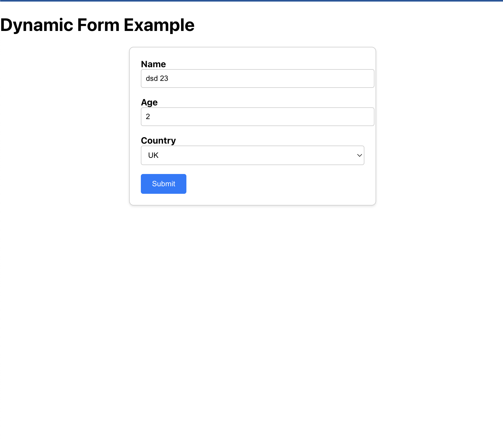

# Test for Sierra Interactive (Real Estate CRM Software)

## Instructions

Exercise:

Goal: Create a dynamic form using a frontend framework and TypeScript. Render it based on a provided configuration array and capture user input.

Requirements:

- Use hooks or equivalent, and a state management tool.
- Configurations specify type (e.g., "text", "number", "select"), label, and options (for select types).
- Include a submit button. On submission, display the captured data.
- Ensure a mobile-first, responsive design.
- Employ TypeScript for type definitions and checks

## Available Scripts

In the project directory, you can run:

### `npm start`

Runs the app in the development mode.\
Open [http://localhost:3000](http://localhost:3000) to view it in the browser.

The page will reload if you make edits.\
You will also see any lint errors in the console.

### `npm test`

Launches the test runner in the interactive watch mode.\
See the section about [running tests](https://facebook.github.io/create-react-app/docs/running-tests) for more information.

### `npm run build`

Builds the app for production to the `build` folder.\
It correctly bundles React in production mode and optimizes the build for the best performance.

The build is minified and the filenames include the hashes.\
Your app is ready to be deployed!

See the section about [deployment](https://facebook.github.io/create-react-app/docs/deployment) for more information.

## Learn More

To learn React, check out the [React documentation](https://reactjs.org/).
